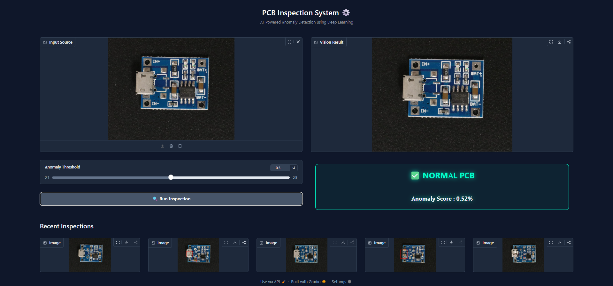
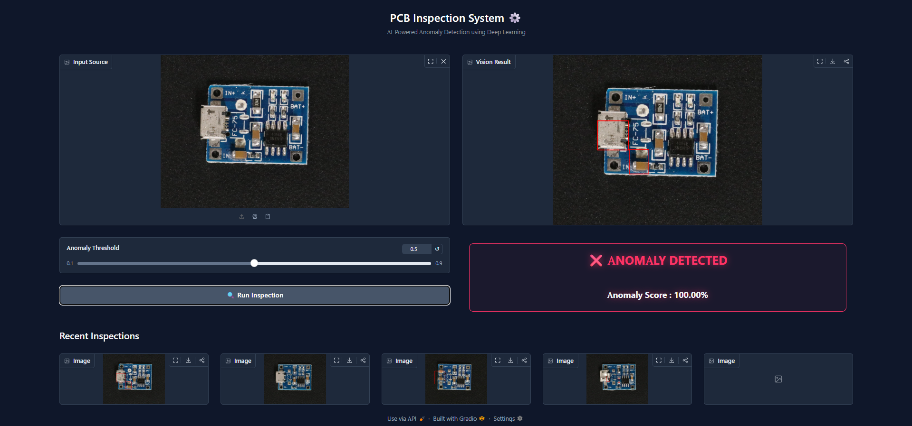
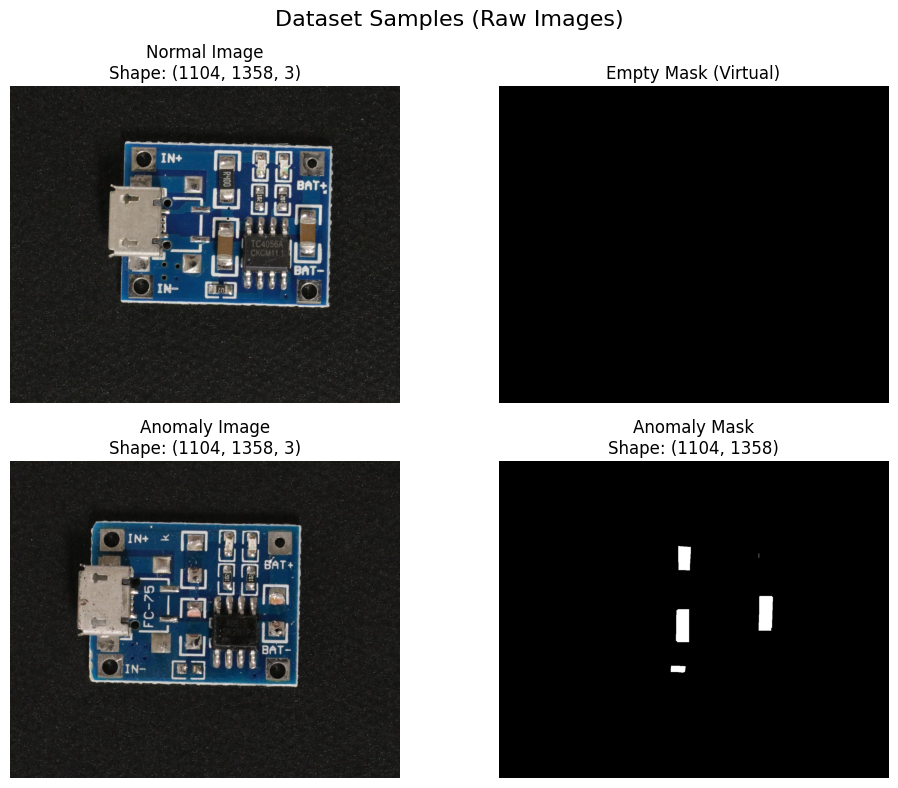
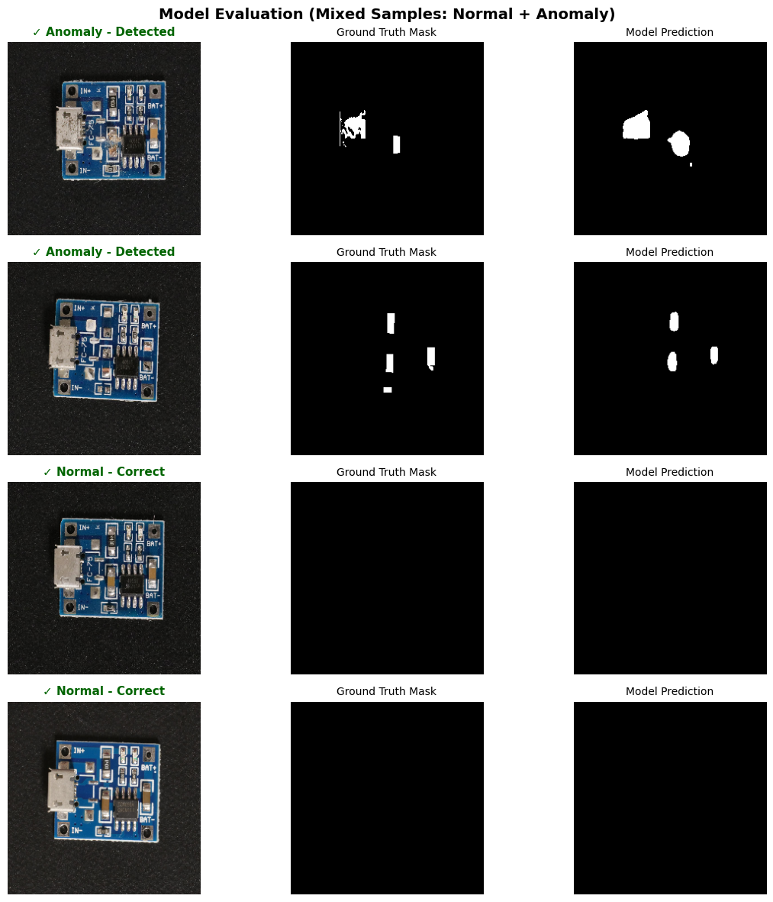
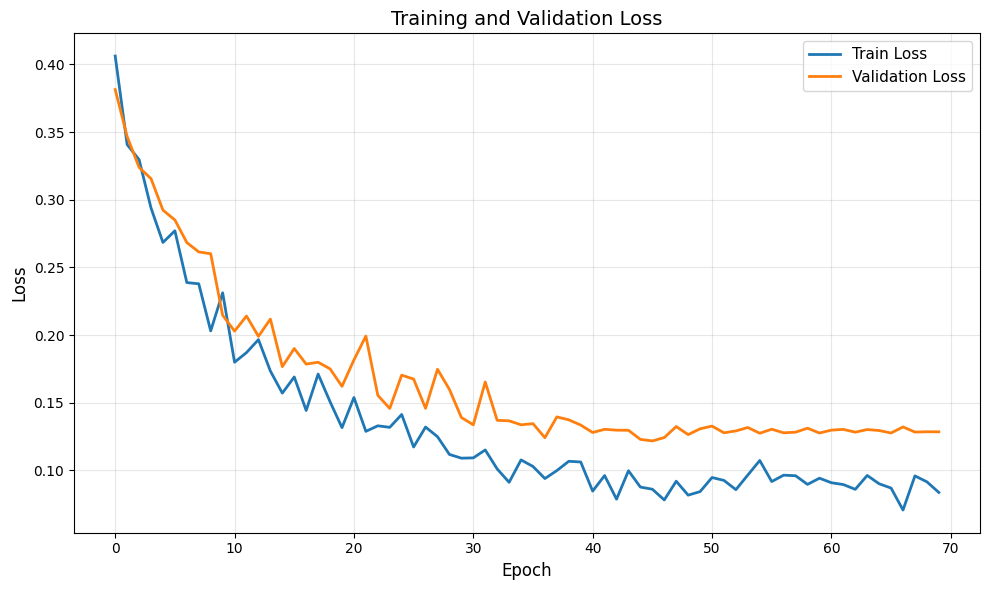

# ⚙️ Smart PCB Quality Inspection System

An end-to-end, AI-powered computer vision system designed to automate defect detection and anomaly segmentation in Printed Circuit Boards (PCBs). This repository features a Deep Learning model trained using PyTorch and an interactive web interface powered by Gradio.

---

## 🖥️ User Interface Preview

Here is the interactive Gradio web app in action, demonstrating both normal and anomaly detection states with live visual bounding boxes and session history tracking:

<p align="center">
  
  
</p>

---

## ✨ Features

* **Deep Learning Segmentation:** Leverages a **U-Net** architecture with a **ResNet34** encoder (via `segmentation_models_pytorch`) for high-precision defect localization.
* **Interactive UI:** Built with **Gradio**, allowing inspectors to upload PCB images, adjust defect confidence thresholds in real-time, and view binary masks.
* **Visual Fault Isolation:** Highlights detected anomalies automatically with clean, red bounding boxes directly on the original board image.
* **Recent History Tracking:** Saves and displays the last 5 inspected images within the session, enabling quick click-to-reload historical comparisons.

---

## 📊 Model Training & Dataset

The model was trained on Google Colab using a T4 GPU. Below are snapshots of the dataset visualization, augmentation pipeline, and the training evaluation metrics:

<p align="center">
  
  
  
</p>

---

## 📂 Repository Structure

* `main.py`: The production-ready application containing the inference logic, image preprocessing pipeline, and Gradio UI layout.
* `PCBAnomalyDetector_Model.ipynb`: The Google Colab Jupyter Notebook used for dataset preparation, data augmentation (`albumentations`), and model training.
* `requirements.txt`: The complete Python dependencies breakdown required to deploy the system locally.

---

## 🛠️ Installation & Local Setup

Follow these steps to get the interactive PCB inspector running on your local machine:

### 1. Clone the Repository
```bash
git clone [https://github.com/YOUR_USERNAME/PCB-Anomaly-Detection.git](https://github.com/YOUR_USERNAME/PCB-Anomaly-Detection.git)
cd PCB-Anomaly-Detection
